# ParallelPortWithPythonAndWindowsIn2026
How read and write pcie parallel port signals with python parallel64 with Windows

## The circuit

The hardware schematic is from this source

### From forum.linuxcnc.org

[simple parallel port tester board](https://forum.linuxcnc.org/18-computer/55803-a-simple-parallel-port-tester-board)

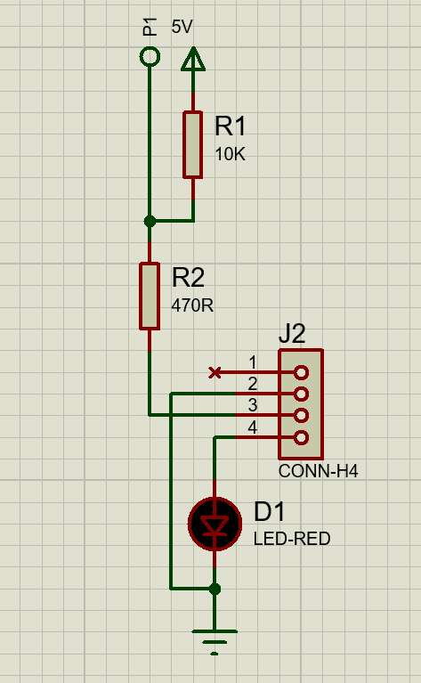

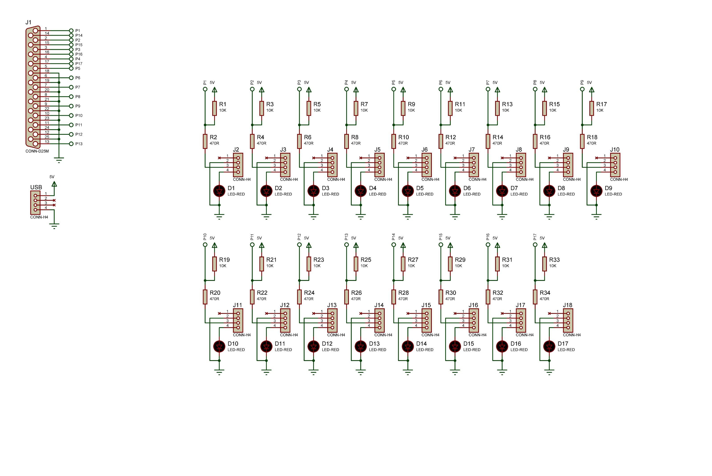

I modified it because some pin are not in/out but only in

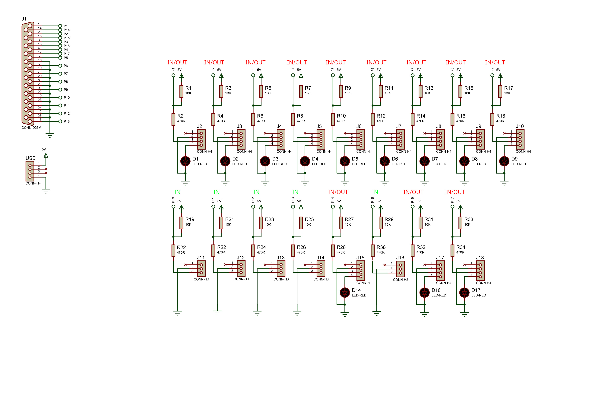

This is the soldered prototype

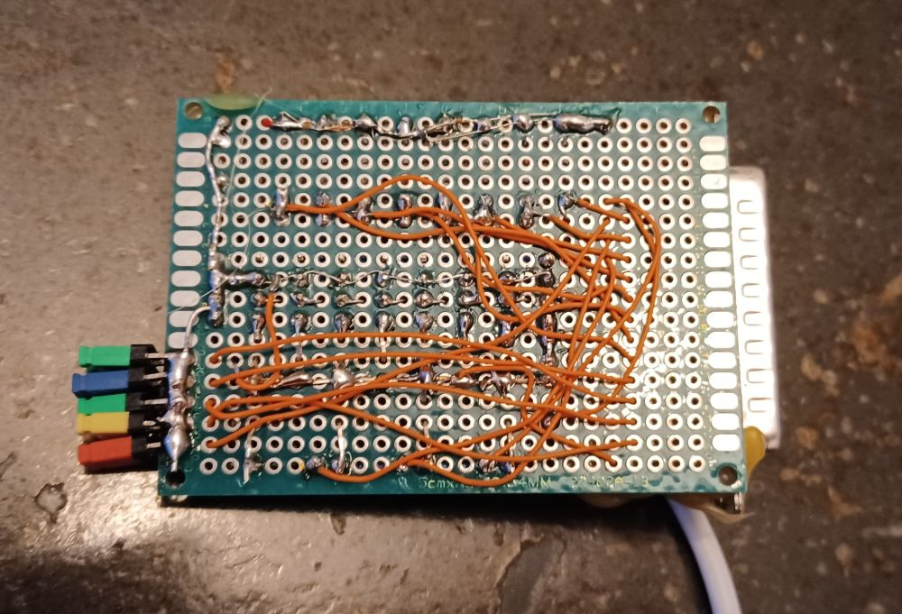

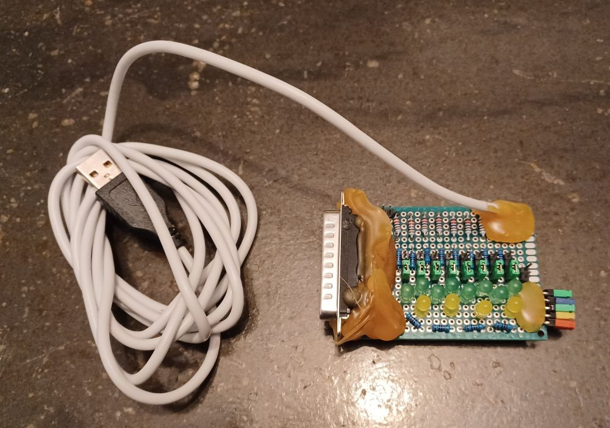

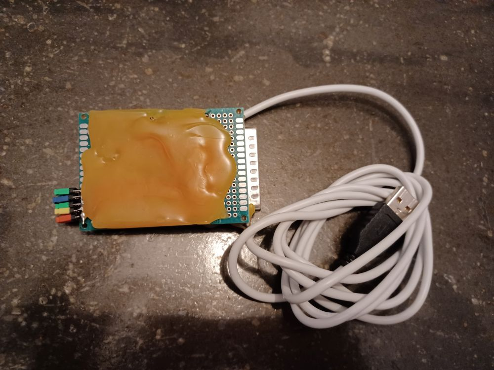

### Some Pcie parallel port boards

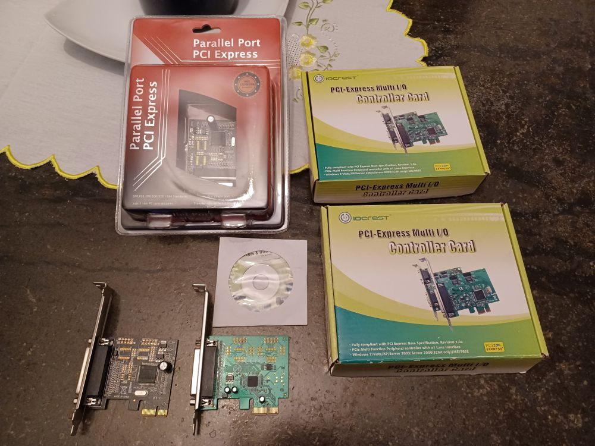

### The software for the tests from www.downtowndougbrown.com available in resouces folder

### [Parallel Port Tester windows software](https://www.downtowndougbrown.com/2013/06/parallel-port-tester/)

Here you can find the parallel port address 0xEFF8.
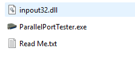

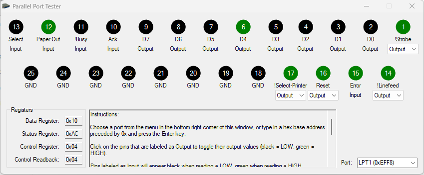

### I checked the Windows hardware pane to confirm the parallel port address 0xEFF8

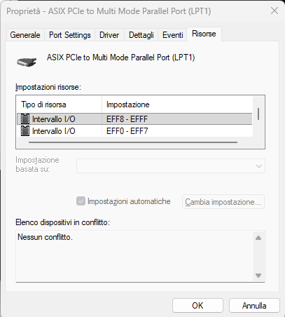

In last century the standards addresses were 0x378 for LPT1, 0x278 for LPT2, but with new processors with more address space today all changed.

### You must download the InpOut32 library from https://www.highrez.co.uk and add it to the Paralle Port Tester se the image abowe.

[InpOutx64](https://www.highrez.co.uk/Downloads/InpOut32/default.htm)

## Install python parallel64 library from https://github.com/tekktrik/parallel64.git

## documentation here https://parallel64.readthedocs.io/en/latest/installation.html#downloading-parallel64

## copy the inpout64 library on the python package, run some test program and find where in the error path.

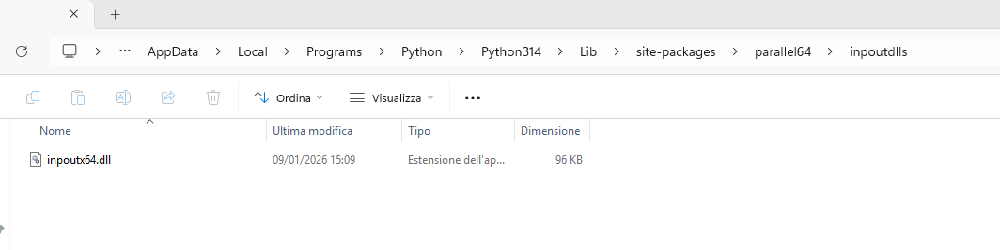

## Some test programs in src:

[write_test_data__and_control.py](src/write_test_data__and_control.py)

### Remember correct the code with your parallel port adress!
